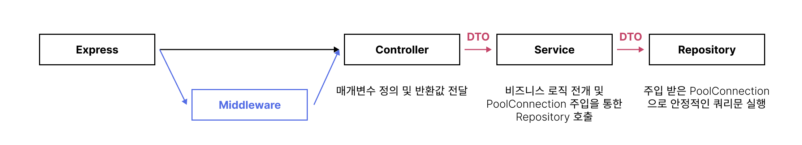

# 항해 주특기 3주차 팀 과제

> 본 저장소는 항해99 주특기 숙련주차에 진행된 팀 단위로 서버 개발에 제작되었습니다.<br>
> [JeungHoSub/hanghae_node3week](https://github.com/JeungHoSub/hanghae_node3week)

<hr>

### 소개글



<hr>

### 참여자

- @JeungHoSub - [GitHub](https://github.com/JeungHoSub) / [Velog](https://velog.io/@wlwjsan)
- @Rumaro122 - [GitHub](https://github.com/Rumaro122) 
- @codeing999 - [GitHub](https://github.com/codeing999) / [Velog](https://velog.io/@mero)
- @unchaptered - [GitHub](https://github.com/unchaptered) / [Velog](https://github.com/unchaptered)

<hr>

### 문서 리스트

> 문서 리스트를 확인하시려면 [자세히 보기](./docs/README.md) 를 클릭해주세요.

1. [Git 관련 문서](./docs/git/README.md)
    1. [Git 전략](./docs/git/Git-%EC%A0%84%EB%9E%B5.md)
    2. [Git 문법](./docs/git/Git-%EB%AC%B8%EB%B2%95.md)
    3. [Git 커밋규칙](./docs/git/Git-%EC%BB%A4%EB%B0%8B%EA%B7%9C%EC%B9%99.md)
2. [기능 리스트](./docs/%EA%B8%B0%EB%8A%A5%20%EB%A6%AC%EC%8A%A4%ED%8A%B8.md)
3. [API 리스트](./docs/api/README.md)
    1. [Auth 명세서](./docs/api/auth.md)
    2. [Article 명세서](./docs/api/article.md)
    3. [Comment 명세서](./docs/api/comment.md)
4. [테이블 명세서](./docs/sql/README.md)
    1. [SQL Script](./docs/sql/default.sql)
5. [Env 설정서](./docs/env/README.md)
6. [함수 및 변수명](./docs/name/README.md)

<hr>

### 폴더 구조

```cmd
root
├ /.github              # GitHub 에서 제공해주는 Issue 및 PR 탬플릿 기능을 사용 중입니다.
├ /docs                 # 작업을 진행하면서 정한 각종 규칙과 설명 들이 문서화 되어 있습니다.
├ /src
│ ├ /layers             # Layered Architecture 패턴에 따라서 분리된 3 계층과 Router 가 들어있습니다.
│ ├ /modules            # Jwt 나 Bcrypt 와 같이 특수한 라이브러리 를 가공해 만든 Module 이 들어있습니다.
│ ├ db.js               # 데이터베이스 연결 Module 이 들어있습니다.
│ ├ env.js              # 환경변수 호출 Module 이 들어있습니다.
│ └ index.js            # 서버 실행 부분입니다.
├ package-lock.json
├ package.json
└ README.md
```

<hr>

### 모듈 리스트

```json
"dependencies": {
    "bcrypt": "^5.0.1",
    "dotenv": "^16.0.1",
    "express": "^4.18.1",
    "joi": "^17.6.0",
    "jsonwebtoken": "^8.5.1",
    "morgan": "^1.10.0",
    "mysql2": "^2.3.3"
},
"devDependencies": {
    "nodemon": "^2.0.19"
}
```